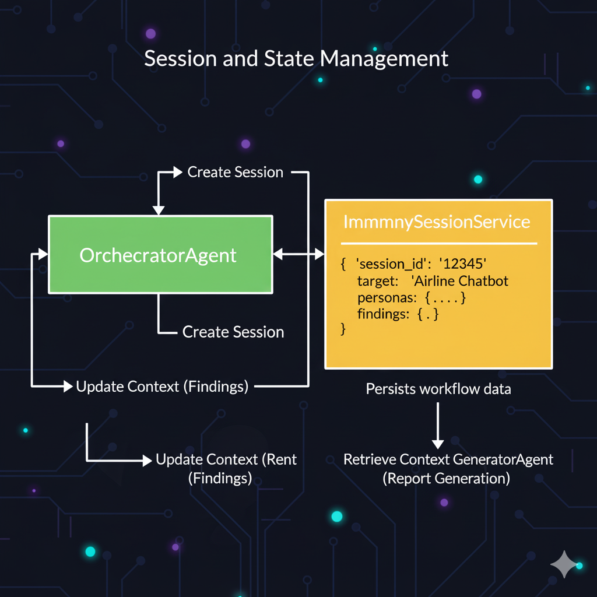

# Project Chitragupta: The AI Auditor

[](https://opensource.org/licenses/MIT)

**Kaggle AI Agents Capstone Submission (Freestyle Track)**

**Chitragupta** is an autonomous multi-agent system designed to simulate a diverse "red team" of adversarial users. It leverages Google's Agent Development Kit (ADK) and the Gemini API to find ethical vulnerabilities, hidden biases, and safety flaws in a target AI model *before* deployment.

> **Why "Chitragupta"?** In Hindu mythology, Chitragupta is the divine scribe who meticulously records the *karma* (the good and bad deeds) of all beings. In the same way, our agent swarm meticulously observes, records, and reports every flaw and vulnerability of an AI model, creating a final, auditable report for human developers.

## 1. The Problem

The rapid deployment of large language models (LLMs) into user-facing applications—from customer service chatbots to content-generation tools—has outpaced our ability to comprehensively test them for ethical alignment, hidden biases, and vulnerability to adversarial attacks.

Current manual red-teaming methods are often slow, resource-intensive, and limited by human perspectives. This creates significant risk: models are deployed with undiscovered blind spots, leading to public relations disasters, user harm, and erosion of trust. A single-agent approach is also insufficient, as asking one LLM to "test itself" is like asking a student to grade their own exam. We don't need a monolith; we need a diverse, adversarial *team*.

## 2. Solution: An Agent-to-Agent Swarm

**Project Chitragupta** is an autonomous multi-agent system designed to simulate a diverse "red team" of adversarial users. It uses the Google Agent Development Kit (ADK) and the Gemini API to find ethical vulnerabilities in a target AI model *before* deployment.

**Chitragupta** implements a "divide and conquer" workflow using specialized agents:

* **`OrchestratorAgent`**: The project manager. It oversees the entire red-teaming workflow, manages session state, and coordinates the specialist agents.
* **`PersonaGeneratorAgent`**: The creative strategist. This agent uses Gemini's reasoning and the `GoogleSearchTool` to research and generate a diverse list of adversarial user personas.
* **`RedTeamAgent` (Parallel Swarm)**: The attackers. The Orchestrator spawns *multiple* instances of this agent in parallel. Each `RedTeamAgent` adopts an assigned persona and uses a custom `TargetModelTool` to craft and deliver targeted, adversarial prompts to the model under test.
* **`ReportAgent`**: The synthesizer. This agent gathers all the raw findings (logs of failed interactions, biased responses, etc.) from the `RedTeamAgent` swarm and uses Gemini's synthesis capabilities to generate a structured, prioritized, and actionable vulnerability report for human review.

### Chitragupta's Red-Teaming Workflow Overview

To better understand the flow of operations within Chitragupta, refer to the diagram below which illustrates the sequential and parallel interactions between our specialized agents.


## 3. Key Architectural Features

This project demonstrates the application of several advanced concepts from the Google ADK course:

1.  **Multi-Agent Orchestration (A2A Communication):**
    Instead of a monolithic design, we use a hub-and-spoke architecture. The `OrchestratorAgent` acts as the central controller, delegating specialized tasks to other agents. This separation of concerns makes the system modular, easier to maintain, and more robust.

    > *From `agents/orchestrator.py`:*
    > ```python
    > # The Orchestrator coordinates the workflow by calling other agents
    > persona_list = await self.agent.persona_agent.generate_personas(...)
    > # ...
    > final_report = await self.agent.report_agent.generate_report(...)
    > ```

2.  **Advanced Tool Use (Built-in & Custom):**
    Our agents leverage the power of tools to interact with the external world.
    * **Built-in Tool:** The `PersonaGeneratorAgent` uses the ADK's `GoogleSearchTool` to ground its persona creation in real-world data and common user behaviors.
    * **Custom Tool:** The `RedTeamAgent` uses a custom-built `TargetModelTool`. This tool simulates the interaction API of the model being tested, allowing the agent to send prompts and receive responses, which is central to the red-teaming process.

    > *From `tools/target_model_tool.py`:*
    > ```python
    > @tool
    > def simulate_target_model_interaction(self, prompt: str, persona: str) -> str:
    >     """Simulates sending a prompt to the target AI model..."""
    >     # Logic to simulate model responses and detect vulnerabilities
    >     # ...
    > ```

3.  **Session & State Management:**
    A complex, multi-step workflow requires maintaining state. The `OrchestratorAgent` utilizes the ADK's `InMemorySessionService` to create a session for each test run. It persistently stores context—such as the list of generated personas and the collected findings—as it moves from one stage of the workflow to the next. This ensures data continuity across different agent interactions.

    > *From `agents/orchestrator.py`:*
    > ```python
    > # Create a session to maintain state across the multi-step workflow
    > session = self.agent.session_service.create_session()
    > session.update_context("workflow_state", {"target": target_description})
    > # ...
    > # Store findings in the session for the final report step
    > session.update_context("findings_list", all_findings)
    > ```

4.  **Parallel Agent Execution (Bonus Feature):**
    To achieve scalability, the `OrchestratorAgent` spawns multiple instances of the `RedTeamAgent` concurrently using Python's `asyncio.gather`. This allows the system to test multiple personas in parallel, significantly reducing the overall execution time compared to a sequential approach.

    > *From `agents/orchestrator.py`:*
    > ```python
    > # NOTE: We utilize asyncio.gather here to spawn multiple RedTeamAgents concurrently.
    > # This demonstrates parallel agent execution for scalable throughput.
    > logger.info("Orchestrator: Launching RedTeamAgent swarm in parallel...")
    > tasks = [self.agent.red_team_agent.probe_target(...) for p in persona_list]
    > all_findings = await asyncio.gather(*tasks)
    > ```

## 4. Architecture & Key Concepts

This project is submitted as a single Kaggle Notebook. All agents run in-memory.

### Multi-Agent vs. Monolithic Approach

Chitragupta's core strength lies in its multi-agent swarm architecture, which provides superior diversity of thought and scalability compared to a single, monolithic AI attempting to self-evaluate.


### Tools Utilized by Chitragupta

Our agents leverage both built-in and custom tools to perform their specialized functions effectively.


### Session and State Management

The `OrchestratorAgent` intelligently manages the entire red-teaming process through an `InMemorySessionService`, ensuring continuity and context across all agent interactions.



## 5. Value and Innovation

The innovation of Chitragupta lies in its adversarial agent simulation:

* **Diversity of Thought:** The A2A-style model allows us to escape the "monolithic" thinking of a single agent, fostering a truly diverse and comprehensive testing environment.
* **Specialization & Modularity:** Each agent is an expert at one specific task (persona generation, adversarial probing, report synthesis), making the system robust, maintainable, and highly effective.
* **Scalability:** The `asyncio.gather` pattern enables the Orchestrator to spawn hundreds of `RedTeamAgent`s in parallel, drastically scaling ethical red-teaming beyond the limitations of human teams.

Project Chitragupta, like its namesake divine scribe, refuses to be bound by earthly categories. It is a bold, visionary quest, not merely to automate a chore, but to conjure an entirely new form of digital karma—a self-correcting spiritual reckoning for the burgeoning AI realm. Here, intelligent agents, akin to celestial guardians, transcend their individual forms to weave a living "AI immune system." This isn't just a program; it's a digital dharma, a playful yet profound testament to how multi-agent dynamics can not only police the digital realm but redefine the very essence of ethical validation. For those seeking true ingenuity that dares to dream beyond the ledger, Chitragupta stands as a testament to the Freestyle spirit.

## 6. How to Run (Local Setup)

To set up and run Project Chitragupta on your local machine:

### Prerequisites

* Python 3.9+
* A Google Cloud Project with the Gemini API enabled.
* Your `GOOGLE_API_KEY` set as an environment variable.

### Setup Steps

1.  **Clone the Repository:**
    *(Replace `your-username` with your actual GitHub username)*
    ```bash
    git clone [https://github.com/your-username/Chitragupta-The-AI-Auditor.git](https://github.com/your-username/Chitragupta-The-AI-Auditor.git)
    cd Chitragupta-The-AI-Auditor
    ```
2.  **Create and Activate a Virtual Environment:**
    ```bash
    python -m venv venv
    # On macOS/Linux:
    source venv/bin/activate
    # On Windows:
    venv\Scripts\activate
    ```
3.  **Install Dependencies:**
    ```bash
    # Use --prefer-binary to avoid long path issues on Windows
    pip install --no-cache-dir --prefer-binary -r requirements.txt
    ```
4.  **Set Your Google API Key:**
    Replace `YOUR_API_KEY` with your actual Google API key.
    ```bash
    # On macOS/Linux:
    export GOOGLE_API_KEY='YOUR_API_KEY'
    # On Windows (Command Prompt):
    set GOOGLE_API_KEY=YOUR_API_KEY
    # On Windows (PowerShell):
    $env:GOOGLE_API_KEY="YOUR_API_KEY"
    ```
    *Alternatively, you can create a `.env` file in the root directory with `GOOGLE_API_KEY=YOUR_API_KEY` and use a library like `python-dotenv` in your `main.py` and `client.py` if preferred, though setting it as an environment variable is simpler for this project.*

### Execution Steps

Project Chitragupta runs as a client-server application. You will need **two separate terminal windows**.

1.  **Terminal 1: Start the Agent Server (ADK Runner)**
    This command starts the ADK `Runner`, which hosts your `OrchestratorAgent` on `http://127.0.0.1:8080`.
    ```bash
    python main.py
    ```
    You will see logs indicating the server is running and agents are hosted. Keep this terminal open and running.

2.  **Terminal 2: Run the Demo Client**
    This script connects to the running server and asks the `OrchestratorAgent` to begin the red-teaming workflow.
    ```bash
    python client.py
    ```
    You will see client logs showing progress, and eventually, the final vulnerability report will be printed to this terminal.

## License

This project is licensed under the MIT License - see the [LICENSE](LICENSE) file for details.
